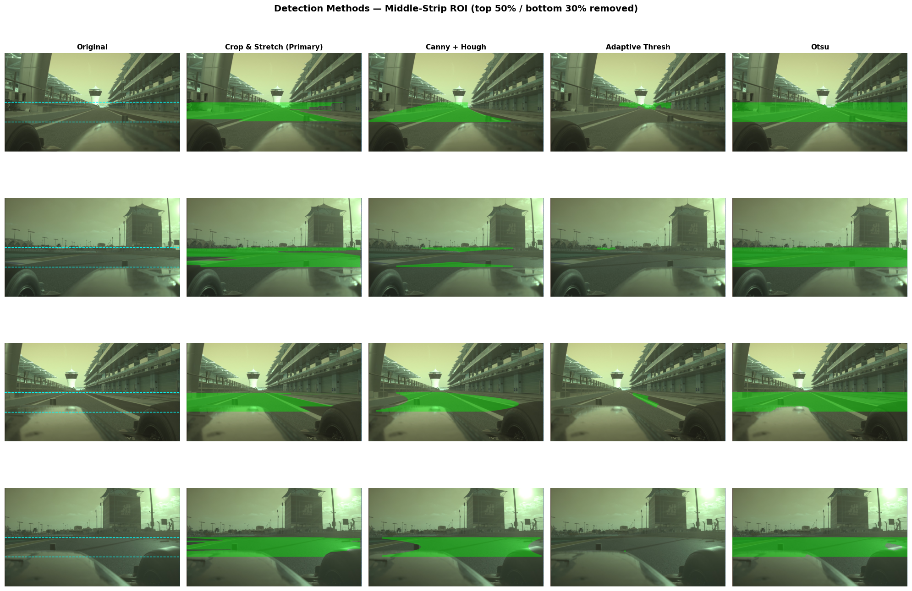
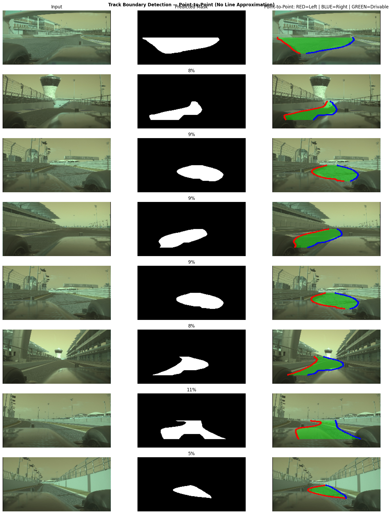
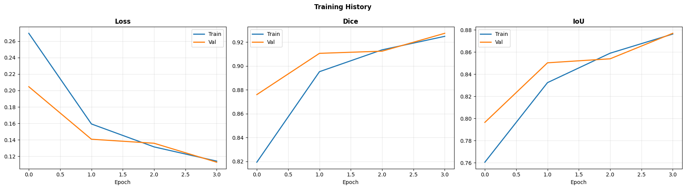
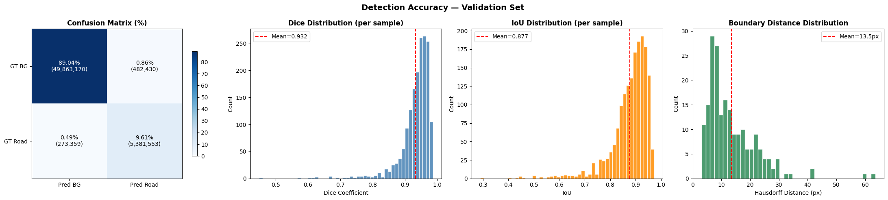
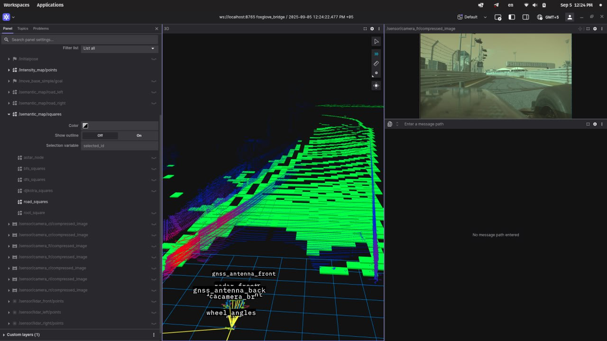
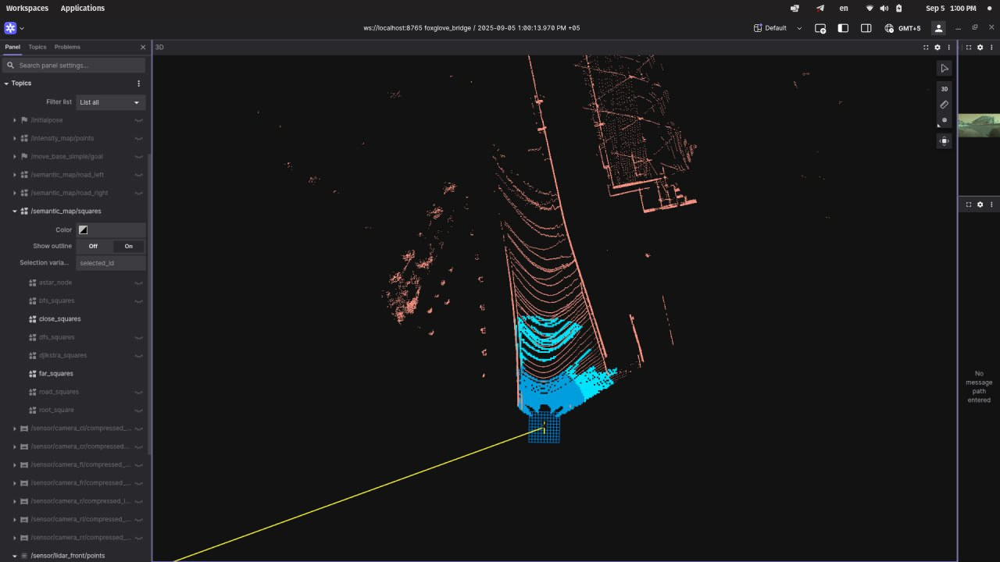
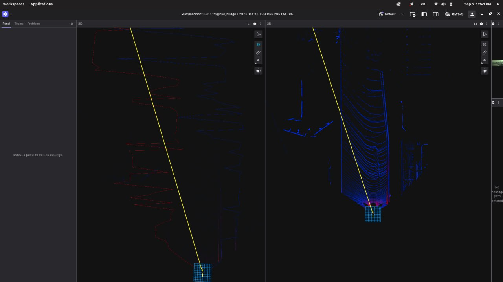
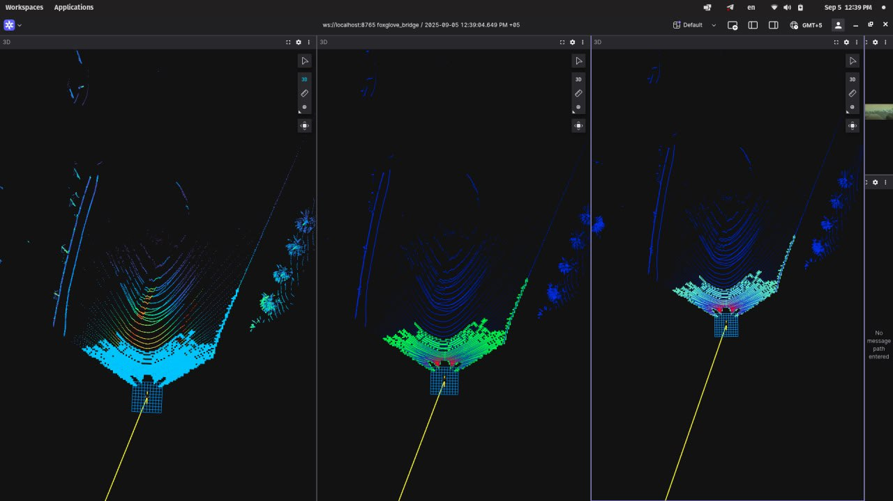

# Lane Detection PCL

**Real-time road surface segmentation and lane boundary detection using both LiDAR point clouds and Computer Vision** — with four path-planning algorithms running on the detected road grid, all visualized in RViz2.

Two detection pipelines in one repo:
- **LiDAR (PCL)** — ground-plane segmentation + grid-based path planning in ROS 2
- **Computer Vision** — U-Net road segmentation trained on camera feeds, with contour-based boundary extraction

---

## Problem

Autonomous vehicles need to understand road geometry in real time. Camera-based lane detection fails in poor lighting, rain, and fog. LiDAR provides reliable 3D geometry regardless of conditions — but turning a raw point cloud into "this is the road, these are the lanes, here's a driveable path" requires multiple processing stages that are hard to prototype quickly in ROS 2.

## Solution

**LiDAR pipeline** — ROS 2 package (`ransac_seg`) takes raw `PointCloud2` data from a front-facing LiDAR and:

1. **Segments the road surface** using ground-plane filtering (RANSAC-ready interface)
2. **Fits smooth spline curves** to left and right lane boundaries
3. **Runs 4 path-planning algorithms** (A\*, BFS, DFS, Dijkstra) on the discretized road grid
4. **Publishes everything as RViz markers** for immediate visual feedback

**Computer Vision pipeline** — processes camera images to:

1. **Compares 4 classical detection methods** (Crop & Stretch, Canny + Hough, Adaptive Threshold, Otsu)
2. **Trains a U-Net** with Dice + BCE combined loss for road segmentation
3. **Extracts left/right track boundaries** via contour analysis on U-Net predictions
4. **Evaluates quantitatively** with Dice, IoU, Hausdorff distance metrics

---

## Demo

### Computer Vision Pipeline

#### Detection Methods Comparison
> 4 classical CV methods evaluated on middle-strip ROI: Crop & Stretch, Canny + Hough, Adaptive Threshold, Otsu.



#### U-Net Boundary Extraction
> Input camera image → U-Net predicted mask → Track boundaries (RED = left, BLUE = right, GREEN = drivable zone).



#### Training & Evaluation
> U-Net training curves (Loss, Dice, IoU) and validation accuracy metrics (confusion matrix, Dice/IoU distributions, Hausdorff distance).

| Training History | Accuracy Metrics |
|:---:|:---:|
|  |  |

### LiDAR Pipeline

#### Road Surface Grid + Camera Feed
> Green grid tiles overlay the detected road surface. Front camera feed shown top-right for reference.



### A* Path Planning on Road Grid
> Cyan grid = segmented road. Yellow line = A\* shortest path from vehicle to goal.



### Lane Boundary Detection
> Left: red lane boundary curves (spline fit). Right: LiDAR point cloud with road overlay.



### Algorithm Comparison (A* / BFS / DFS)
> Three panels showing different path-planning algorithms running simultaneously on the same road grid.



---

## Quick Start

```bash
# 1. Clone into your ROS 2 workspace
cd ~/ros2_ws/src && git clone https://github.com/kekeront/lane-detection-pcl.git

# 2. Install deps + build
cd ~/ros2_ws && rosdep install --from-paths src --ignore-src -r -y && colcon build --packages-select ransac_seg

# 3. Source and launch all nodes
source install/setup.bash && ros2 launch ransac_seg algorithms.launch.py
```

Then open **RViz2** and add Marker displays for `/semantic_map/squares`, `/semantic_map/road_left`, `/semantic_map/road_right`.

---

## Architecture

```
┌─────────────────────────────────────────────────────────────┐
│                    SENSOR INPUTS                            │
│  LiDAR PointCloud2           Camera Images                  │
└──────┬───────────────────────────┬──────────────────────────┘
       │                           │
       ▼                           ▼
 ┌─────────────┐           ┌──────────────────┐
 │ ransac_node  │           │ Classical CV      │
 │ Ground-plane │           │ Canny/Hough/Otsu  │
 │ filter       │           │ Middle-strip ROI  │
 └──────┬───────┘           └────────┬─────────┘
        │                            │ training masks
   ┌────┴────┐                       ▼
   ▼         ▼               ┌──────────────┐
┌───────┐ ┌──────────┐       │ U-Net        │
│ curve │ │ Path     │       │ Dice+BCE loss│
│ Lane  │ │ Planners │       │ Mixed FP16   │
│ spline│ │ A*/BFS/  │       └──────┬───────┘
└───┬───┘ │ DFS/Dijk │              │
    │     └────┬─────┘              ▼
    ▼          ▼             ┌──────────────┐
  RViz2 Visualization       │ Boundary     │
                             │ Extraction   │
                             │ L/R contours │
                             └──────────────┘
```

> Full LiDAR architecture: [`docs/architecture.md`](docs/architecture.md)

---

## Key Features

### LiDAR (ROS 2)
- **Ground-plane segmentation** — Z-axis filter with a clean interface for swapping in RANSAC
- **Spline lane boundaries** — `scipy.interpolate.UnivariateSpline` fits smooth left/right curves
- **4 path planners** — A\* (heuristic), BFS (shortest), DFS (exploratory), Dijkstra (uniform-cost)
- **Grid discretization** — continuous point cloud → 0.5m cells, shared across all nodes
- **Single launch file** — `ros2 launch ransac_seg algorithms.launch.py` starts everything

### Computer Vision
- **4 classical detection methods** — compared side-by-side on middle-strip ROI
- **U-Net segmentation** — trained with Dice + BCE combined loss, mixed-precision (FP16)
- **Contour-based boundary extraction** — left/right edge + drivable zone from predicted masks
- **Quantitative evaluation** — Dice, IoU, Hausdorff distance, confusion matrix on validation set

---

## ROS 2 Topics

### Subscribed

| Topic | Type | Description |
|-------|------|-------------|
| `/sensor/lidar_front/points` | `sensor_msgs/PointCloud2` | Raw LiDAR point cloud |

### Published

| Topic | Type | Description |
|-------|------|-------------|
| `/semantic_map/squares` | `visualization_msgs/Marker` | Road surface grid (CUBE_LIST) |
| `/semantic_map/road_left` | `visualization_msgs/Marker` | Left lane boundary (LINE_STRIP) |
| `/semantic_map/road_right` | `visualization_msgs/Marker` | Right lane boundary (LINE_STRIP) |

---

## Project Structure

```
lane-detection-pcl/
├── ransac_seg/                          # ROS 2 LiDAR pipeline
│   ├── ransac_node.py                   # Core road segmentation node
│   ├── curve.py                         # Lane boundary spline fitting
│   ├── astar.py                         # A* path planning
│   ├── bfs.py                           # BFS path planning
│   ├── dfs.py                           # DFS path planning
│   └── djikstra.py                      # Dijkstra path planning
├── track_boundary_detection_clean.ipynb  # CV pipeline (U-Net + classical)
├── checkpoint.ipynb                      # CV baseline experiments
├── launch/
│   └── algorithms.launch.py             # Launch all ROS 2 nodes
├── docs/
│   ├── architecture.md                  # LiDAR pipeline architecture
│   └── screenshots/                     # Demo visualizations
├── package.xml
├── setup.py
└── setup.cfg
```

---

## Tech Stack

| Component | Technology |
|-----------|-----------|
| Middleware | ROS 2 (ament_python) |
| Language | Python 3.10+ |
| Point Cloud | sensor_msgs_py / PointCloud2 |
| Deep Learning | TensorFlow / Keras (U-Net) |
| Classical CV | OpenCV (Canny, Hough, Otsu) |
| Math | NumPy, SciPy |
| Visualization | RViz2 / Foxglove / Matplotlib |

---

## Dependencies

- **ROS 2** (Humble or later, `ament_python` build)
- `rclpy`, `sensor_msgs`, `sensor_msgs_py`, `visualization_msgs`, `geometry_msgs`
- `numpy`, `scipy`

---

## Usage

### Individual nodes

```bash
ros2 run ransac_seg ransac_node     # Road grid only
ros2 run ransac_seg curve           # Road grid + lane curves
ros2 run ransac_seg astar           # A* path on grid
ros2 run ransac_seg bfs             # BFS path on grid
ros2 run ransac_seg dfs             # DFS path on grid
ros2 run ransac_seg djikstra        # Dijkstra path on grid
```

### All at once

```bash
ros2 launch ransac_seg algorithms.launch.py
```

---

## Limitations

- Ground-plane filter uses a simple Z < 0.2m threshold — not yet full RANSAC plane fitting
- Path planners use uniform step cost (no terrain weighting)
- No obstacle avoidance layer — planners only consider road-surface cells
- Lane boundary detection assumes a single road corridor (no intersections)

---

## Roadmap

- [ ] Replace Z-threshold with RANSAC plane fitting for robust segmentation
- [ ] Add obstacle point clustering and avoidance constraints
- [ ] Weighted grid costs based on distance from lane center
- [ ] Support for multi-lane detection and intersections
- [ ] Integration with `nav2` for full autonomous navigation stack

---

## License

This project is licensed under the **GNU General Public License v3.0**. See [LICENSE](LICENSE) for details.
